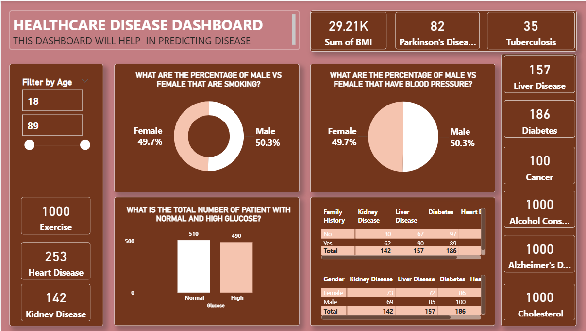

# 🏥 Healthcare Disease Analysis Dashboard

## 📌 Overview
An interactive dashboard analyzing patient health data to help surface risk factors and disease patterns — built with **Power BI** *(update this if you actually built it in Tableau or Excel)*. It combines KPI cards, demographic breakdowns, and cross-tab tables to help explore how factors like gender, family history, glucose levels, and smoking relate to disease outcomes.

- **Tool used:** Power BI Desktop
- **Dataset:** Patient health records (age, gender, BMI, glucose, smoking status, blood pressure, family history, exercise/alcohol/cholesterol habits, and diagnosed conditions)
- **Visuals used:** KPI cards, donut chart, pie chart, column chart, matrix (cross-tab) tables, age range slicer
---

## 🎯 Objectives
- Give a quick summary view of key patient metrics (BMI, disease counts, lifestyle factors)
- Let users filter the whole dashboard by patient age range
- Compare disease and risk-factor prevalence by gender
- Explore how family history and gender relate to rates of kidney disease, liver disease, diabetes, and heart disease
- Support early-stage disease pattern exploration / prediction groundwork

---

## 🖥️ Dashboard Walkthrough

### Filter by Age (slicer)
A range slider lets users filter every visual on the dashboard to a specific patient age band (default: 18–89), so all downstream numbers reflect only the selected age group.

### KPI Cards
Top and side cards give at-a-glance totals across the (filtered) patient population:
- **Sum of BMI:** 29.21K
- **Disease counts:** Parkinson's Disease (82), Tuberculosis (35), Liver Disease (157), Diabetes (186), Cancer (100), Heart Disease (253), Kidney Disease (142)
- **Lifestyle/behavior counts:** Exercise (1,000), Alcohol Consumption (1,000), Alzheimer's Disease (1,000), Cholesterol (1,000)

### Percentage of Male vs Female That Are Smoking (donut chart)
Nearly an even split — **Male 50.3%** vs **Female 49.7%** — suggesting smoking prevalence in this dataset doesn't skew strongly by gender.

### Percentage of Male vs Female That Have Blood Pressure (pie chart)
Also close to even — **Male 50.3%** vs **Female 49.7%** — mirroring the smoking split, which may reflect the overall gender balance of the dataset rather than a disease-specific pattern.

### Total Number of Patients With Normal vs High Glucose (column chart)
Patients are nearly evenly split between **Normal (510)** and **High (490)** glucose readings — glucose alone isn't a strongly skewed indicator in this population.

### Disease Counts by Family History (matrix table)
Cross-tabs whether a patient has a family history of disease against counts of Kidney Disease, Liver Disease, Diabetes, and Heart Disease:

| Family History | Kidney Disease | Liver Disease | Diabetes | Heart Disease* |
|---|---|---|---|---|
| No | 80 | 67 | 97 | — |
| Yes | 62 | 90 | 89 | — |
| **Total** | **142** | **157** | **186** | — |

*Heart Disease column is cut off in the current screenshot — worth confirming the full numbers when you update this table.*

### Disease Counts by Gender (matrix table)
Same disease breakdown, split by gender instead of family history:

| Gender | Kidney Disease | Liver Disease | Diabetes | Heart Disease* |
|---|---|---|---|---|
| Female | 73 | 72 | 86 | — |
| Male | 69 | 85 | 100 | — |
| **Total** | **142** | **157** | **186** | — |

---

## 📈 Key Insights
- Gender splits for smoking and blood pressure are both close to 50/50, closely tracking the overall gender balance of the dataset rather than showing a strong gender-specific risk pattern.
- Glucose levels are nearly evenly split between normal and high, so glucose status alone doesn't dominate the patient population one way or the other.
- Family history does shift disease counts: patients with a family history show notably higher Liver Disease counts (90 vs. 67) than those without, while Kidney Disease is actually higher among patients with **no** family history (80 vs. 62) — worth digging into further.
- Diabetes and Heart Disease are among the most common conditions tracked, both well above Kidney Disease, Cancer, and Tuberculosis in raw counts.

---

## 🛠️ Skills Demonstrated
- Power BI report design: KPI cards, donut/pie charts, column chart, matrix (cross-tab) visuals
- Interactive filtering with a range slicer tied to every visual on the page
- Cross-tabulating categorical health factors (gender, family history) against multiple disease outcomes
- Dashboard layout for exploratory healthcare analytics

---

## 🚀 How to Use This Report
1. Download `dataset/healthcare-dash.pbix`.
2. Open it in **Power BI Desktop**.
3. Use the **Filter by Age** slider to narrow the dashboard to a specific age range and watch all visuals update.

---

## 📬 Contact
**Usama Abdullahi Sani**
- LinkedIn: www.linkedin.com/in/usama-abdullahi-sani-60a2b6248
- Email: usamasaniabdullahi814@gmail.com
